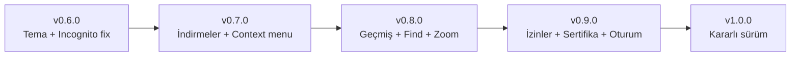

# 🧭 İlgezdi — Tarayıcı Gereksinim Analizi

> [!info] Bağlam
> Bu not, `v0.6.0` sürümü kapsamında yapılan **Claude Design tema entegrasyonu** ve **incognito düzeltmeleri** sonrası, İlgezdi'yi standart bir web tarayıcısı ile karşılaştıran gereksinim/eksik analizidir. Kaynak inceleme: `src/main/`, `src/renderer/`, `src/preload/`.

İlgili notlar: [[İlgezdi — Sürüm Geçmişi]] · [[İlgezdi — Tema Sistemi]]

---

## ✅ Mevcut Özellikler (Çalışıyor)

| Özellik | Durum | Not |
|---|---|---|
| Sekmeler (aç/kapat/geçiş) | ✅ | `Ctrl+T`, `Ctrl+W`; BrowserView tabanlı |
| Navigasyon (geri/ileri/yenile/ana sayfa) | ✅ | `Alt+←/→`, `F5` |
| Adres çubuğu (URL + arama) | ✅ | `Ctrl+L`; öneri/autocomplete **yok** |
| Yer imleri (çubuk + panel + yıldız popup) | ✅ | Popup artık pencere-farkında |
| Gizli pencere (incognito) | ✅ | `Ctrl+Shift+N`; v0.6'da düzeltildi |
| Ayarlar paneli | ✅ | Tema, font, gizlilik, veri temizleme |
| Reklam/izleyici engelleme | ✅ | `configureSession` tüm partition'lara uygular |
| VPN (WireGuard) | ✅ | Özel özellik; profil, ping, DNS-leak testi |
| Ziyaret günlüğü (secure log) | ✅ | SQLite; CSV export |
| Glance (link önizleme) | ✅ | v0.6'da pencere-farkında yapıldı |
| Güvenlik başlıkları + parmak izi koruması | ✅ | HSTS, X-Frame-Options, UA maskeleme |
| Tema sistemi (4 tema) | ✅ | Ötüken/Umay/Kağan/Hibrit — v0.6 |
| Yeni sekme sayfası | ✅ | Selamlama + arama + kısayol + haber |
| Giriş/kayıt (QRtım) | ✅ | Auth ekranı |
| Pencere kontrolleri (macOS/Windows) | ✅ | Trafik ışığı / Windows düğmeleri |

---

## 🔴 Kritik Eksikler (Standart tarayıcıda olmazsa olmaz)

> [!danger] Bunlar bir tarayıcıyı "kullanılabilir" yapan temel gereksinimlerdir.

- [ ] **İndirmeler (Downloads)** — `session.will-download` handler'ı **hiç yok**. Dosya indirmeleri sessizce çalışmıyor. İndirme yöneticisi ekranı yalnızca "Yakında eklenecek" placeholder. `pickDownloadFolder` ayarı var ama kullanılmıyor. → #kritik
- [ ] **Sağ tık bağlam menüsü (context menu)** — Kopyala/yapıştır, geri/ileri, "bağlantıyı yeni sekmede aç", "resmi kaydet", "incele" gibi hiçbir sağ tık menüsü yok. → #kritik
- [ ] **İzin yönetimi (permissions)** — `setPermissionRequestHandler` yok. Kamera/mikrofon/konum/bildirim istekleri yönetilmiyor (Electron varsayılanı bazılarını otomatik verebilir → gizlilik/güvenlik riski). → #kritik #güvenlik
- [ ] **Sertifika hatası yönetimi** — `certificate-error` handler'ı yok; geçersiz HTTPS sertifikalarında kullanıcı uyarılmıyor. → #kritik #güvenlik

## 🟠 Önemli Eksikler (Beklenen temel işlevler)

- [ ] **Geçmiş sayfası (History)** — Ziyaretler DB'de tutuluyor ama arayüz "Yakında eklenecek" placeholder. Kenar çubuğundaki geçmiş düğmesi boş ekran açıyor.
- [ ] **Sayfa içinde arama (`Ctrl+F`)** — `findInPage` API'si kullanılmıyor.
- [ ] **Yakınlaştırma (`Ctrl +/-/0`)** — `setZoomFactor` yok.
- [ ] **Yazdırma (`Ctrl+P`)** — `webContents.print` yok.
- [ ] **Adres çubuğu önerileri** — Geçmiş/yer imi tabanlı autocomplete açılır listesi yok.
- [ ] **Oturum geri yükleme** — Kapatılan sekmeler / son oturum başlangıçta geri yüklenmiyor.
- [ ] **Kapatılan sekmeyi geri aç (`Ctrl+Shift+T`)** — yok.
- [ ] **İndirmeler / Keşfet ekranları** — placeholder.

## 🟡 İyileştirmeler (Kalite / gizlilik)

- [ ] **Incognito günlük gizliliği** — Gizli pencerede günlük paneli açılınca **ana profilin geçmişi** görünüyor. Gizli modda geçmiş/günlük düğmeleri devre dışı olmalı (yıldız düğmesi gibi gizlenmeli).
- [ ] **Blocker istatistik hatası** — `setupBlocker(defaultSession)` sayaçları sekmeler için hiç artmıyor (sekmeler partition session kullanıyor). Gerçek engelleme `configureSession/isBlocked` üzerinden çalışıyor ama **blocker paneli istatistikleri ~0 gösteriyor**. Sayaç `isBlocked` yoluna taşınmalı.
- [ ] **Blocker canlı toggle** — Engelleyiciyi ayarlardan açıp/kapatmak mevcut sekmeleri etkilemiyor (session handler'ları sekme oluşturulurken kuruluyor); yenileme gerekiyor.
- [ ] **Orta tık ile sekme kapatma / sürükle-sırala / sabitlenmiş sekme** — yok.
- [ ] **Normal yeni pencere (`Ctrl+N`)** — yalnızca incognito var, standart yeni pencere yok.

---

## 🐛 v0.6.0'da Düzeltilen Hatalar

> [!success] Bu sürümde giderildi
- [x] **Incognito — yer imi popup'ı yanlış pencerede** — `bookmark-popup-*` handler'ları sabit `mainWindow` kullanıyordu; artık isteği yapan pencere (`event.sender`) baz alınıyor. (`src/main/main.js`)
- [x] **Incognito — Glance ana pencerede açılıyor** — `glance-main.js` tamamen `mainWindow`'a bağlıydı; pencere-farkında hale getirildi (`BrowserWindow.fromWebContents`).
- [x] **Tema token uyumsuzluğu** — Tema anahtarı eski renkleri taşıyordu; 4 tema Claude Design token'larıyla birebir hizalandı, yanlış inline `--accent` bindirmesi giderildi.

---

## 🗺️ Önerilen Sürüm Yol Haritası

| Sürüm | Kapsam | Öncelik |
|---|---|---|
| **v0.6.0** ✅ | Tema sistemi, incognito düzeltmeleri | — |
| **v0.7.0** | İndirmeler + sağ tık menüsü | 🔴 Kritik |
| **v0.8.0** | Geçmiş sayfası, `Ctrl+F`, zoom, yazdırma | 🟠 Önemli |
| **v0.9.0** | İzin yönetimi, sertifika hataları, oturum geri yükleme, incognito gizlilik | 🔴🟡 |
| **v1.0.0** | Adres çubuğu önerileri, sekme UX, kararlılık | 🟡 |

---

## 📌 Öncelik Matrisi

| # | Madde | Etki | Efor | Öncelik |
|---|---|---|---|---|
| 1 | İndirmeler | Yüksek | Orta | 🔴 |
| 2 | Sağ tık menüsü | Yüksek | Orta | 🔴 |
| 3 | İzin yönetimi | Yüksek (güvenlik) | Düşük | 🔴 |
| 4 | Sertifika hatası | Yüksek (güvenlik) | Düşük | 🔴 |
| 5 | Geçmiş sayfası | Orta | Düşük (veri hazır) | 🟠 |
| 6 | Find / Zoom / Print | Orta | Düşük | 🟠 |
| 7 | Incognito günlük gizliliği | Orta (gizlilik) | Düşük | 🟡 |
| 8 | Blocker istatistik | Düşük | Düşük | 🟡 |

#ilgezdi #roadmap #analiz
